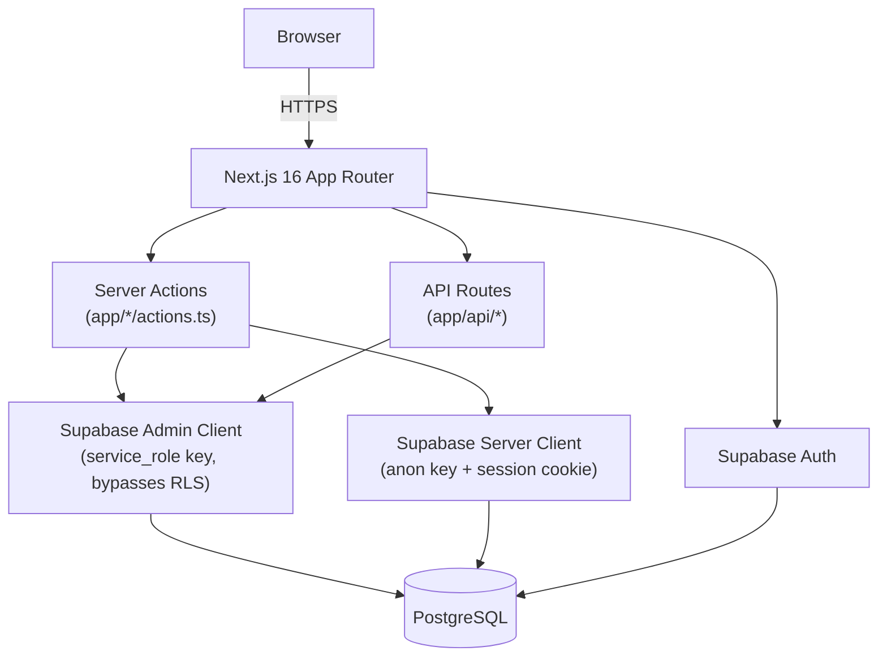

# Design Document: Platform Enhancements — RBAC & Packages

## Overview

This document describes the technical design for a set of critical platform enhancements to the BanqueiroDaZunga field banking management system. The changes span authentication, access control, data modeling, GPS capture, and administrative reporting.

The system is a Next.js 16 (App Router) application backed by Supabase (PostgreSQL + Auth). UI is built with Tailwind CSS and shadcn components. The three user roles — `admin`, `banqueiro`, and `chefe` (displayed as "Líder") — each have separate route trees (`/admin`, `/banqueiro`, `/chefe`).

The enhancements fall into these themes:

1. **Authentication fixes** — iOS Safari login redirect (Req 1) and forced password change on first login (Reqs 4, 5, 20)
2. **Access control** — Presence write-lock to admin-only (Req 2); líder data scoping (Req 8)
3. **Package restructuring** — Collapse 4 package types into 1 Zungueira with 4 classes (Reqs 3, 18)
4. **User management** — Líder balcão validation (Req 6); automatic banqueiro-líder sync (Reqs 7, 19)
5. **GPS capture** — First presence at a market captures device coordinates (Req 9)
6. **Admin dashboard and reporting** — General Statistics replacing Performance Reports (Req 10); hierarchical filters (Req 11); reporting by Province, Market, Banqueiro, Balcão, Líder (Reqs 12–16); global admin oversight (Req 17)

---

## Architecture

### High-Level Request Flow



### Route Architecture

| Route Prefix | Role | Guard |
|---|---|---|
| `/admin/*` | admin | Layout checks `papel === 'admin'` |
| `/banqueiro/*` | banqueiro | Layout + `requires_password_change` redirect |
| `/chefe/*` | chefe (líder) | Layout; scoped queries via `numero_balcao` |

No root-level Next.js middleware exists today. Route protection is handled inside layout components using client-side Supabase session checks. The forced password change guard (Req 5) will be added in the banqueiro layout.

### Key Design Decisions

**Client-side navigation for login (Req 1):** The banqueiro login page already uses `useRouter` / `router.push`. The bug is that `router.push` is being called without waiting for `requires_password_change` to be checked, and on iOS Safari the Supabase session cookie is not immediately visible before the push. The fix is to perform a `router.refresh()` followed by `router.push()` (or use `window.location.href` as a last resort for iOS compatibility). The design unifies all three login pages to follow the same async-safe pattern.

**Password change interception (Req 5):** A `useEffect` in `BanqueiroLayout` reads the profile after auth and redirects to `/banqueiro/alterar-senha` if `requires_password_change` is true. This guards all child routes without requiring middleware.

**Presence write restriction (Req 2):** The `updatePresence` and `createManualPresence` server actions in `app/chefe/actions.ts` currently use an admin client that bypasses RLS. The fix adds an explicit role check (`papel !== 'admin'`) at the top of those actions before any DB writes. Supabase RLS policies will additionally enforce this at the database layer.

**Zungueira package restructuring (Req 3):** `PACOTES` in `lib/types.ts` is replaced by `PACKAGE_CLASSES` (the 4 class values). Display strings use the `"Zungueira — [Class]"` format. The `Pacote` type becomes `ZungueiraClass`. Account creation UI shows the class selector; display renders the full string.

**Banqueiro-líder sync (Req 7):** Synchronization runs inside the `registerProfile` and `editProfile` server actions, in a transaction-like pattern (delete existing → insert new). The `leader_banqueiro_associations` table (Req 19) stores the mappings.

**GPS capture on first presence (Req 9):** The `PresenceForm` component is extended to check whether the assigned market already has GPS coordinates. If not, it requests device location before saving, with a 10-second timeout. The presence save is not blocked by GPS failure.

**Admin reporting (Reqs 10–17):** A new `/admin/relatorios` page is introduced. The existing admin dashboard (`/admin/page.tsx`) replaces "Relatórios de Desempenho" with a "Estatísticas Gerais" section. Filter state is persisted in URL query parameters using `useSearchParams` / `useRouter`.

---

## Components and Interfaces

### New and Modified Pages

| File | Change |
|---|---|
| `app/banqueiro/login/page.tsx` | Fix redirect to use `router.refresh()` then `router.push('/banqueiro')` |
| `app/chefe/login/page.tsx` | Same iOS-safe redirect fix |
| `app/admin/login/page.tsx` | Same iOS-safe redirect fix |
| `app/banqueiro/layout.tsx` | Add `requires_password_change` intercept |
| `app/banqueiro/alterar-senha/page.tsx` | **New** — forced password change form |
| `app/admin/page.tsx` | Replace "Relatórios de Desempenho" with "Estatísticas Gerais" + hierarchical filters |
| `app/admin/relatorios/page.tsx` | **New** — full reporting interface (Province, Market, Banqueiro, Balcão, Líder) |
| `app/banqueiro/abrir-conta/page.tsx` | Update package selector to Zungueira class model |
| `app/chefe/presencas/page.tsx` | Remove write controls; read-only for líder |
| `app/chefe/page.tsx` | Remove "Corrigir"/"Marcar Falta" buttons; show read-only badges |

### New and Modified Server Actions

| File | Change |
|---|---|
| `app/auth/actions.ts` | Add `requires_password_change` check post-login |
| `app/admin/actions.ts` | `registerProfile`: add `initial_password` field, set `requires_password_change=true`, validate password length 8–128; `editProfile`: validate `numero_balcao` for chefe role; add `syncLiderBanqueiros()` helper |
| `app/banqueiro/actions.ts` | `registerPresence`: add GPS-to-market logic; `changePassword()`: new action |
| `app/chefe/actions.ts` | `updatePresence` / `createManualPresence`: add admin-only guard |

### New Components

| Component | Purpose |
|---|---|
| `components/admin/general-statistics.tsx` | Displays Contas Abertas, Pacotes Vendidos, TPAs Entregues with optional filter scope |
| `components/admin/hierarchical-filters.tsx` | Province → Balcão → Market cascade dropdowns |
| `components/admin/report-filters.tsx` | Combined filter panel for the reports page (Province, Market, Banqueiro, Balcão, Líder) |
| `components/banqueiro/change-password-form.tsx` | Controlled form for first-login password change |

### Interfaces (TypeScript)

```typescript
// lib/types.ts additions/changes

// Replace old PACOTES constant
export const PACKAGE_CLASSES = ["Mãezinha", "Mãe", "Mãe Grande", "Mamoite"] as const;
export type ZungueiraClass = (typeof PACKAGE_CLASSES)[number];
export const ZUNGUEIRA_LABEL = "Zungueira";
export function formatPacote(cls: ZungueiraClass): string {
  return `${ZUNGUEIRA_LABEL} — ${cls}`;
}

// New flag on Profile
export type Profile = {
  // ... existing fields ...
  requiresPasswordChange?: boolean;
};

// New association type
export type LiderBanqueiroAssociation = {
  id: string;
  leaderId: string;
  banqueiroId: string;
  balcao: string;
  createdAt: string;
};

// Audit log entry
export type PasswordAuditLog = {
  userId: string;
  eventType: "password_changed" | "password_change_failed";
  timestamp: string; // UTC ISO
  ipAddress: string;
  failureReason?: string;
};

// Report filter state
export type ReportFilters = {
  province?: string;
  balcao?: string;
  mercadoId?: string;
  banqueiroId?: string;
  liderId?: string;
  startDate?: string; // ISO date
  endDate?: string;   // ISO date
};

// General statistics result
export type GeneralStats = {
  contasAbertas: number;
  pacotesVendidos: number;
  tpasEntregues: number;
};
```

---

## Data Models

### Existing Tables (with additions)

#### `profiles` table

| Column | Type | Change |
|---|---|---|
| `id` | uuid | — |
| `email` | text | — |
| `nome` | text | — |
| `codigo_interno` | text | — |
| `papel` | text | — (`'banqueiro'`, `'chefe'`, `'admin'`) |
| `telefone` | text nullable | — |
| `provincia` | text nullable | — |
| `local_id` | uuid nullable | — |
| `numero_balcao` | text nullable | — (validated 1–50 non-whitespace chars for `chefe`) |
| `ativo` | boolean | — |
| **`requires_password_change`** | **boolean NOT NULL DEFAULT false** | **NEW** |

#### `markets` table

| Column | Type | Change |
|---|---|---|
| `id` | uuid | — |
| `nome` | text | — |
| `provincia` | text | — |
| `tipo` | text | — |
| `balcao` | text nullable | — |
| `latitude` | numeric(10,6) nullable | Previously non-null; relaxed to nullable |
| `longitude` | numeric(10,6) nullable | Previously non-null; relaxed to nullable |
| `raio_metros` | integer | — |

GPS columns are nullable so a market can exist before coordinates are captured.

#### `accounts` table

| Column | Type | Change |
|---|---|---|
| `pacote` | text | Values now follow `"Zungueira — [Class]"` format |

No schema change needed for the column itself; the migration updates existing rows.

#### `presences` table

No schema changes. Access control enforced via server action guards + RLS policies.

### New Tables

#### `leader_banqueiro_associations`

```sql
CREATE TABLE leader_banqueiro_associations (
  id          uuid PRIMARY KEY DEFAULT gen_random_uuid(),
  leader_id   uuid NOT NULL REFERENCES profiles(id) ON DELETE CASCADE,
  banqueiro_id uuid NOT NULL REFERENCES profiles(id) ON DELETE CASCADE,
  balcao      text,
  created_at  timestamptz NOT NULL DEFAULT now(),
  UNIQUE (leader_id, banqueiro_id)
);
```

#### `password_audit_logs`

```sql
CREATE TABLE password_audit_logs (
  id             uuid PRIMARY KEY DEFAULT gen_random_uuid(),
  user_id        uuid NOT NULL,
  event_type     text NOT NULL CHECK (event_type IN ('password_changed', 'password_change_failed')),
  timestamp      timestamptz NOT NULL DEFAULT now(),
  ip_address     text NOT NULL,
  failure_reason text,
  created_at     timestamptz NOT NULL DEFAULT now()
);

-- Retention: rows older than 90 days may be purged (pg_cron or manual)
CREATE INDEX idx_password_audit_logs_user_id ON password_audit_logs(user_id);
CREATE INDEX idx_password_audit_logs_timestamp ON password_audit_logs(timestamp);
```

### Database Migrations

#### Migration 1: Add `requires_password_change` to profiles

```sql
ALTER TABLE profiles
  ADD COLUMN IF NOT EXISTS requires_password_change boolean NOT NULL DEFAULT false;
```

#### Migration 2: Create `leader_banqueiro_associations`

As shown above.

#### Migration 3: Create `password_audit_logs`

As shown above.

#### Migration 4: Relax GPS columns on markets

```sql
ALTER TABLE markets
  ALTER COLUMN latitude DROP NOT NULL,
  ALTER COLUMN longitude DROP NOT NULL;
```

#### Migration 5: Package data migration (Req 18)

```sql
BEGIN;

UPDATE accounts SET pacote = 'Zungueira — Mãezinha'  WHERE pacote = 'Mãezinha';
UPDATE accounts SET pacote = 'Zungueira — Mãe'        WHERE pacote = 'Mãe';
UPDATE accounts SET pacote = 'Zungueira — Mãe Grande' WHERE pacote = 'Mãe Grande';
UPDATE accounts SET pacote = 'Zungueira — Mamoite'    WHERE pacote = 'Mamoite';

-- Operator log: SELECT count(*) grouped per new value
DO $$
DECLARE
  r RECORD;
BEGIN
  FOR r IN
    SELECT pacote, count(*) AS total
    FROM accounts
    WHERE pacote LIKE 'Zungueira — %'
    GROUP BY pacote
  LOOP
    RAISE NOTICE 'Migration result: pacote=% count=%', r.pacote, r.total;
  END LOOP;
END $$;

COMMIT;
```

If any error occurs, PostgreSQL rolls back the entire transaction automatically.

### RLS Policies

#### `presences` table — restrict writes to admin

```sql
-- Allow admin to do everything
CREATE POLICY "admin_full_presences" ON presences
  FOR ALL
  TO authenticated
  USING (
    (SELECT papel FROM profiles WHERE id = auth.uid()) = 'admin'
  );

-- Allow banqueiro to insert their own presence only
CREATE POLICY "banqueiro_insert_own_presence" ON presences
  FOR INSERT
  TO authenticated
  WITH CHECK (
    profile_id = auth.uid()
    AND (SELECT papel FROM profiles WHERE id = auth.uid()) = 'banqueiro'
  );

-- Allow anyone to read presences (líderes read-only via SELECT)
CREATE POLICY "read_presences" ON presences
  FOR SELECT
  TO authenticated
  USING (true);
```

#### `leader_banqueiro_associations` table

```sql
-- Admin can manage; leader can read their own associations
CREATE POLICY "admin_manage_associations" ON leader_banqueiro_associations
  FOR ALL
  TO authenticated
  USING ((SELECT papel FROM profiles WHERE id = auth.uid()) = 'admin');

CREATE POLICY "leader_read_own_associations" ON leader_banqueiro_associations
  FOR SELECT
  TO authenticated
  USING (leader_id = auth.uid());
```

#### `password_audit_logs` table

```sql
-- Admin read; server-side writes only via service_role
CREATE POLICY "admin_read_audit_logs" ON password_audit_logs
  FOR SELECT
  TO authenticated
  USING ((SELECT papel FROM profiles WHERE id = auth.uid()) = 'admin');
```

### Report Query Patterns

All report queries follow this shape, parameterised by `ReportFilters`:

```typescript
// Pseudocode — implemented in lib/reports.ts
async function getGeneralStats(
  adminClient: SupabaseClient,
  filters: ReportFilters
): Promise<GeneralStats> {

  let query = adminClient
    .from("accounts")
    .select("id, status, tpa_status, banqueiro_id, mercado_id, created_at");

  if (filters.mercadoId)   query = query.eq("mercado_id", filters.mercadoId);
  if (filters.banqueiroId) query = query.eq("banqueiro_id", filters.banqueiroId);
  if (filters.startDate)   query = query.gte("created_at", filters.startDate);
  if (filters.endDate)     query = query.lte("created_at", filters.endDate + "T23:59:59");

  // Province and Balcão filters require a join via markets / profiles
  // Implemented as subqueries or CTEs in lib/reports.ts

  const { data } = await query;
  return {
    contasAbertas:  data?.filter(a => a.status === "aberta").length ?? 0,
    pacotesVendidos: data?.filter(a => a.status === "aberta").length ?? 0,
    tpasEntregues:  data?.filter(a => a.tpa_status === "entregue").length ?? 0,
  };
}
```

---

## Correctness Properties

*A property is a characteristic or behavior that should hold true across all valid executions of a system — essentially, a formal statement about what the system should do. Properties serve as the bridge between human-readable specifications and machine-verifiable correctness guarantees.*


### Property 1: Non-admin users cannot write presence records

*For any* authenticated user whose `papel` is not `'admin'`, any attempt to create, update, or delete a presence record via server actions SHALL be rejected and return an error, leaving the presences table unchanged.

**Validates: Requirements 2.1, 2.2, 2.3, 2.4**

---

### Property 2: Package class formatting is always "Zungueira — [Class]"

*For any* value in `PACKAGE_CLASSES`, calling `formatPacote(cls)` SHALL return the string `"Zungueira — " + cls` and nothing else.

**Validates: Requirements 3.5**

---

### Property 3: Package class validation — only the 4 defined classes are accepted

*For any* account creation request, if the submitted `pacote` is not one of the 4 defined `PACKAGE_CLASSES` values (or is absent/null), the system SHALL reject the request with a validation error. If the submitted value IS one of the 4 valid classes, the system SHALL accept it.

**Validates: Requirements 3.3, 3.4**

---

### Property 4: Password length validation rejects values outside the 8–128 character range

*For any* password string submitted (at banqueiro creation or password change), if the string's length is less than 8 or greater than 128 characters, the system SHALL reject it with a validation error. If the length is within 8–128, the length check SHALL pass.

**Validates: Requirements 4.4, 4.5, 5.3, 5.4**

---

### Property 5: New banqueiro profiles always have requires_password_change set to true

*For any* successful banqueiro account creation via the admin `registerProfile` action, the resulting `profiles` row SHALL have `requires_password_change = true`.

**Validates: Requirements 4.3**

---

### Property 6: Banqueiro with requires_password_change=true is always intercepted to /banqueiro/alterar-senha

*For any* banqueiro profile where `requires_password_change` is `true`, every navigation attempt to any `/banqueiro/*` route except `/banqueiro/alterar-senha` SHALL be intercepted and redirected to `/banqueiro/alterar-senha`.

**Validates: Requirements 5.1, 5.2**

---

### Property 7: Successful password change sets requires_password_change to false

*For any* banqueiro who successfully completes the password change (valid new password, matches confirmation, differs from initial password), the `profiles` row's `requires_password_change` flag SHALL be set to `false` after the operation.

**Validates: Requirements 5.7**

---

### Property 8: Password confirmation mismatch always fails validation

*For any* pair of strings `(newPassword, confirmation)` where `newPassword !== confirmation`, the password change validation SHALL reject the submission with an error, regardless of the individual string values.

**Validates: Requirements 5.5**

---

### Property 9: New password must differ from initial password

*For any* password change submission where the new password is identical to the stored `initial_password` for that user, the system SHALL reject the change with an error.

**Validates: Requirements 5.6**

---

### Property 10: Líder balcão validation — accepts only non-whitespace strings of 1–50 chars

*For any* string value submitted as `numero_balcao` for a líder profile (at creation or update), if the string contains at least 1 non-whitespace character and has total length ≤ 50, the system SHALL accept it. If the string is absent, empty, whitespace-only, or longer than 50 characters, the system SHALL reject it with a validation error.

**Validates: Requirements 6.1, 6.2, 6.3, 6.4, 6.5**

---

### Property 11: Banqueiro-líder sync creates exactly the right set of associations

*For any* líder creation or `numero_balcao` update, the resulting set of entries in `leader_banqueiro_associations` for that leader SHALL be exactly the set of banqueiro profiles whose `numero_balcao` matches the líder's new `numero_balcao` — no more, no fewer. All previously existing associations for that leader SHALL be removed before new ones are inserted.

**Validates: Requirements 7.1, 7.2, 7.3, 7.4**

---

### Property 12: Líder data scope — all returned records belong to the líder's balcão

*For any* authenticated líder with a `numero_balcao` value, any query for banqueiros, accounts, or presences SHALL return only records whose ownership chain includes a banqueiro profile with `numero_balcao` matching the líder's `numero_balcao`. No record from a different balcão SHALL appear in the result set.

**Validates: Requirements 8.1, 8.2, 8.3, 8.4, 8.5**

---

### Property 13: GPS coordinates are not overwritten for markets that already have them

*For any* presence submission at a market that already has non-null `latitude` and `longitude` stored in the `markets` table, the market's GPS values SHALL remain unchanged after the presence is saved, regardless of what device coordinates were captured.

**Validates: Requirements 9.4**

---

### Property 14: Out-of-range GPS coordinates are rejected and do not update the market

*For any* captured latitude value outside the range [-90, 90] or longitude value outside the range [-180, 180], the GPS validation SHALL reject the coordinate, the market's `latitude`/`longitude` columns SHALL NOT be updated, and the presence record SHALL still be saved without coordinates.

**Validates: Requirements 9.5, 9.6**

---

### Property 15: Package data migration maps every legacy value to the correct Zungueira format

*For any* `accounts` table row where `pacote` is one of the four legacy values (`'Mãezinha'`, `'Mãe'`, `'Mãe Grande'`, `'Mamoite'`), after the migration script executes, that row's `pacote` value SHALL be `'Zungueira — ' + originalValue` and all other fields in that row SHALL remain unchanged.

**Validates: Requirements 3.7, 18.1, 18.2, 18.3, 18.4**

---

### Property 16: Duplicate leader-banqueiro association insertion is silently rejected

*For any* `(leader_id, banqueiro_id)` pair that already exists in `leader_banqueiro_associations`, attempting to insert a second row with the same pair SHALL be rejected by the database unique constraint without causing a fatal application error.

**Validates: Requirements 19.5**

---

### Property 17: Reporting filter accuracy — filtered counts are correct subsets of total data

*For any* combination of filter values (province, balcão, market, banqueiro, líder, date range) applied to the report query function, the returned `contasAbertas`, `pacotesVendidos`, and `tpasEntregues` counts SHALL equal the actual count of matching rows in the `accounts` table for that filter scope. When no filters are applied, the counts SHALL equal the totals across all accounts.

**Validates: Requirements 10.3, 10.4, 10.5, 12.2, 12.3, 12.4, 12.5, 13.2, 13.3, 13.4, 13.5, 14.2, 14.3, 14.4, 14.5, 15.2, 15.3, 15.4, 15.5, 16.2, 16.3, 16.4, 16.5, 17.1, 17.2, 17.3**

---

### Property 18: Admin queries return unscoped data regardless of filter parameters

*For any* data query made by a user with `papel = 'admin'`, the system SHALL NOT apply any `numero_balcao` or `provincia` scope restriction — the admin SHALL always receive results from the full dataset (subject only to explicitly requested filters).

**Validates: Requirements 17.6**

---

### Property 19: Password audit log entries contain all required fields

*For any* password change event (success or failure), the written `password_audit_logs` row SHALL contain non-null values for `user_id`, `event_type`, `timestamp`, and `ip_address`. For failure events, `failure_reason` SHALL also be non-null.

**Validates: Requirements 20.1, 20.2**

---

## Error Handling

### Authentication and Session Errors

- **Login failure**: The login handler catches Supabase auth errors and sets an inline `error` state. No page reload occurs. The form remains interactive.
- **Session expiry**: Supabase SSR client handles token refresh transparently. If a session cannot be refreshed, the layout redirects to the role-specific login page.
- **iOS Safari session race**: After `signInWithPassword`, `router.refresh()` is called to force Next.js to re-fetch server components with the new session cookie before `router.push()` navigates.

### Password Change Errors

| Scenario | Behaviour |
|---|---|
| Password < 8 or > 128 chars | Return `{ error: "..." }` from server action; stay on `/banqueiro/alterar-senha` |
| Confirmation mismatch | Client-side validation before calling server action |
| New password equals initial | Server action returns specific error message |
| Supabase `updateUser` fails | Return error; stay on change page |
| Audit log write fails | Log error to `console.error`; do NOT block the password change |

### GPS Capture Errors

| Scenario | Behaviour |
|---|---|
| `geolocation.getCurrentPosition` timeout (>10s) | Set `captureWarning` state; proceed to save presence without coordinates |
| Permission denied | Same as timeout — non-blocking warning |
| Coordinates out of range | Validate before saving; show warning; save presence with null market GPS |
| Market already has GPS | Skip capture call entirely; save presence normally |

### Synchronization Errors

- If `leader_banqueiro_associations` insert fails for a specific row (e.g. FK violation because a banqueiro was deleted between query and insert), the sync catches the per-row error, logs it, and continues with the remaining rows. The líder creation/update is NOT rolled back due to a partial sync failure.
- If the entire sync DELETE fails, the error is returned and the calling action surfaces it to the admin.

### Database Migration Errors

The migration runs in an explicit `BEGIN`/`COMMIT` block. Any PostgreSQL error within the block causes automatic rollback. The migration function catches the error, outputs it to stderr, and exits with a non-zero code.

### Reporting Query Errors

Report queries are wrapped in try/catch. On error, the component displays a non-blocking error message and shows zero counts rather than crashing the page.

---

## Testing Strategy

### Unit Tests

Unit tests cover pure functions and isolated validation logic:

- `formatPacote(cls)` — package display formatting (all 4 classes)
- `validatePassword(str)` — length 8–128, rejects outside range
- `validateNumeroBalcao(str)` — non-whitespace 1–50 chars
- `validateCoordinates({ latitude, longitude })` — range checks
- `syncAssociations(leaderId, balcao, banqueiros)` — correct set computation
- `applyReportFilters(accounts, filters)` — pure filter function for report counts
- Legacy package display fallback — `displayPacote('Mãezinha')` → `'Zungueira — Mãezinha'`

### Property-Based Tests

Property-based testing is applicable to this feature. The target language is TypeScript and the library to use is **fast-check**.

Each property test must run a minimum of **100 iterations**.

Each test must be tagged with a comment referencing the design property:

```typescript
// Feature: platform-enhancements-rbac-packages, Property 4: Password length validation rejects values outside 8–128
```

**Properties to test (with fast-check):**

| Property | fast-check Arbitraries |
|---|---|
| **P1** Non-admin presence write rejection | `fc.record({ papel: fc.constantFrom('banqueiro', 'chefe') })` + random presence data |
| **P2** Package format string | `fc.constantFrom(...PACKAGE_CLASSES)` |
| **P3** Package class validation | `fc.string()` (random), `fc.constantFrom(...PACKAGE_CLASSES)` (valid) |
| **P4** Password length validation | `fc.string({ minLength: 0, maxLength: 7 })` (too short), `fc.string({ minLength: 129, maxLength: 256 })` (too long), `fc.string({ minLength: 8, maxLength: 128 })` (valid) |
| **P5** New banqueiro has requires_password_change=true | `fc.record({ nome: fc.string(), email: fc.emailAddress(), ... })` |
| **P7** Password change clears requires_password_change | Random valid profile + valid new password |
| **P8** Password confirmation mismatch | Two independent `fc.string()` that are not equal |
| **P9** New password equals initial is rejected | `fc.string()` used as both newPassword and initialPassword |
| **P10** Balcão validation | `fc.string()` for invalid; `fc.string({ minLength: 1, maxLength: 50 }).filter(s => s.trim().length > 0)` for valid |
| **P11** Sync creates exact association set | `fc.array(fc.record({ ... }))` for banqueiro profiles with random balcão values |
| **P12** Líder scope returns only matching records | `fc.array(...)` of profiles with varying balcão + líder identity |
| **P13** GPS not overwritten | `fc.record({ latitude: fc.float({min: -90, max: 90}), longitude: fc.float({min: -180, max: 180}) })` for existing coords |
| **P14** Out-of-range GPS rejected | `fc.oneof(fc.float({max: -90.001}), fc.float({min: 90.001}))` for latitude, similar for longitude |
| **P15** Migration correctness | `fc.array(fc.constantFrom('Mãezinha', 'Mãe', 'Mãe Grande', 'Mamoite'))` |
| **P17** Report filter accuracy | `fc.array(fc.record({ status: fc.constantFrom('aberta','pendente'), tpa_status: ..., mercado_id: ..., banqueiro_id: ..., created_at: fc.date() }))` |
| **P18** Admin unscoped access | Admin identity + random filter params → verify no rows excluded by scope |
| **P19** Audit log fields complete | Random (userId, ip, eventType) tuples |

### Integration Tests

Integration tests verify wiring with Supabase:

- Supabase Auth `createUser` stores hashed password (not plaintext)
- `leader_banqueiro_associations` unique constraint rejects duplicate (leader_id, banqueiro_id)
- RLS policy on `presences` rejects chefe writes at DB layer
- `password_audit_logs` FK to `profiles(id)` is enforced
- Migration script transaction rolls back on simulated error

### Smoke Tests

- `password_audit_logs` table exists with correct schema
- `leader_banqueiro_associations` table exists with FK constraints
- `profiles.requires_password_change` column exists with default `false`
- `markets.latitude` and `markets.longitude` are nullable

### End-to-End Tests (Manual / Playwright)

- iPhone 7 / iOS Safari login redirect (cannot be fully automated without real device)
- Full first-login flow: admin creates banqueiro → banqueiro logs in → redirected to password change → changes password → lands on dashboard
- GPS capture: first presence at a market with null GPS captures coordinates; subsequent presence does not overwrite
- Admin dashboard: filter by Province → verify Balcão dropdown populates → verify stats update
